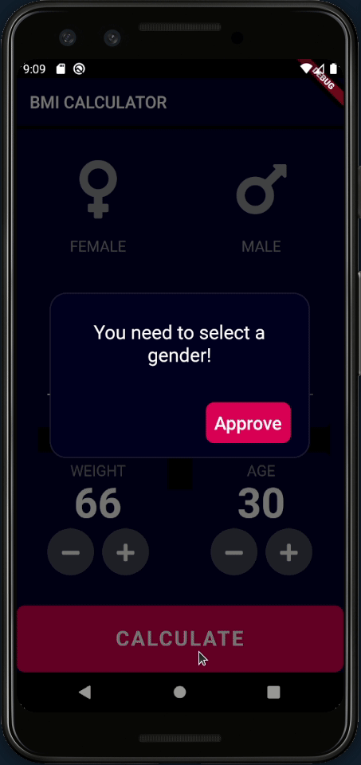

# BMI Calculator

Improved project from [The Complete Flutter Development Bootcamp Using Dart](https://www.appbrewery.co/p/flutter-development-bootcamp-with-dart). Added improved logic and new project architecture.
More info at [the original readme](https://github.com/AsierDev/flutter-course-app-brewery/tree/master/bmi-calculator-flutter)

## Demo

